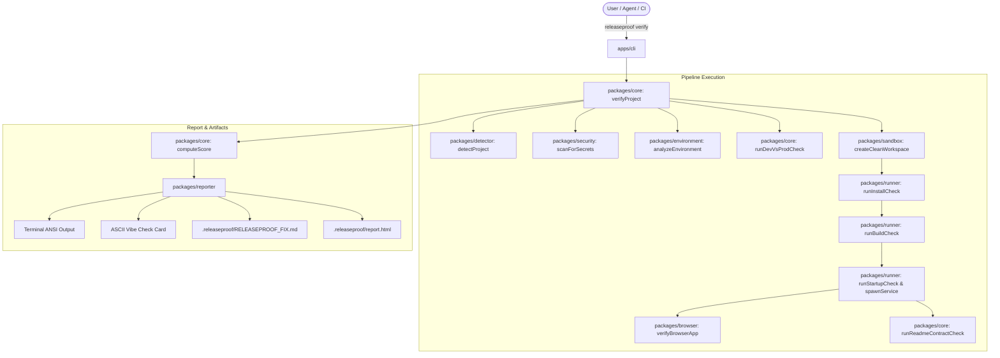

# Architecture of ReleaseProof

ReleaseProof is an autonomous, deterministic production-readiness verification engine for web applications, APIs, and AI-generated software.

## 🏗️ System Overview

---

## 📦 Package Breakdown

### 1. `packages/schemas`
- Pure Zod schemas and TypeScript types.
- Zero dependencies except `zod`.
- Models: `CheckResult`, `Evidence` (discriminated union for command, http, browser, filesystem, screenshot), `ProjectProfile`, `ReleaseProofConfig`, `VerificationReport`.

### 2. `packages/runner`
- Safe command execution (`runCommand`, `spawnService`).
- Tokenizes shell commands into argument arrays.
- Binary resolution on Windows (`resolveBinaryForPlatform`) navigating batch wrappers vs compiled binaries.
- Signal handling & process tree cleanup (`taskkill /T /F` on Windows, negative PID process group kill on POSIX).
- Sockets: TCP port listener checker and HTTP `/` health poller.

### 3. `packages/sandbox`
- Creates ephemeral sandboxes (`rp-sandbox-<rand>`) in `os.tmpdir()`.
- Recursive copy defensive filter: skips `node_modules`, `.next`, `dist`, `.venv`, `.env.local`.
- Boundary containment: guards against path traversal (`..`), dropped symlinks resolving outside the root.

### 4. `packages/detector`
- Static & heuristic framework detection:
  - Next.js (App Router `app/` vs Pages Router `pages/`, `next.config.js`)
  - React + Vite (`vite.config.ts`, `index.html`)
  - Express (`express` dependency, `listen()` port parsing)
  - FastAPI (`fastapi` in `requirements.txt`, `main.py`, `uvicorn` invocation)
  - Generic Node.js & Python
- Detects package managers (`pnpm`, `npm`, `yarn`, `pip`).
- Detects ports via scripts (`-p 3000`, `--port 8080`, `.listen(PORT)`).

### 5. `packages/environment`
- Scans JS/TS/Py AST/source files for `process.env.*`, `import.meta.env.*`, `os.environ[*]`.
- Detects **Client-Exposed Secrets**: variables containing `SECRET`, `PRIVATE`, `PASSWORD`, `DATABASE_URL` that are incorrectly prefixed with `NEXT_PUBLIC_`, `VITE_`, or `REACT_APP_`.
- Cross-references against `.env.example` to detect undocumented variables.

### 6. `packages/security`
- Scans files for exposed credentials:
  - Private key blocks (`BEGIN RSA PRIVATE KEY`)
  - AWS Access Key IDs (`AKIA...`)
  - GitHub Personal Access Tokens (`ghp_...`)
  - Slack Tokens (`xox...`)
  - Unignored, populated `.env` files
- Centralized Redaction: `redactSecrets(string)` and `redactObject(any)` dynamically mask tokens before writing any report.

### 7. `packages/browser`
- Playwright Chromium headless route crawler.
- Fallback to native HTTP crawler if browser binaries or headless display environments are unavailable.
- Collects:
  - Unhandled exceptions (`pageerror`) → Blocker
  - HTTP 500 crashes → Blocker
  - Blank page detection (body empty, childCount = 0) → Blocker
  - Error boundaries (`Application error`) → Blocker
  - Console errors (`console.error`) → Warning
  - 401/403 status on protected routes → Info (Pass)
  - 404 for missing image/asset → Warning (Low)
- Automatically captures full-page PNG screenshots on crashed routes into `.releaseproof/screenshots/`.

### 8. `packages/core`
- Orchestrates the 9-phase verification pipeline.
- `runDevVsProdCheck`: statically parses source code imports against `package.json` to ensure runtime libraries aren't hidden inside `devDependencies`.
- `runReadmeContractCheck`: parses Markdown bash codeblocks in `README.md` and verifies referenced `npm run <script>` commands exist in `package.json`.
- `computeScore`: 0-100 weighted readiness index. **Guarantees that 1 verified blocker forces `readyToShip = false` and `status = NOT_READY`.**

### 9. `packages/reporter`
- Terminal ANSI output with colored badges and tree indicators.
- ASCII Vibe Card generator (`releaseproof vibe`).
- AI Handoff generator (`.releaseproof/RELEASEPROOF_FIX.md`).
- Offline HTML Dashboard (`.releaseproof/report.html`) with embedded screenshots, collapsible logs, zero external CDN scripts, and XSS safety.

### 10. `apps/cli`
- Single standalone entry point (`releaseproof [path]`).
- Commands: `verify` (default), `report`, `vibe`, `doctor`, `clean`.
- Built with esbuild into a self-contained bundle with zero reliance on unpublished workspace packages.

---

## 🔒 Concurrency & Cleanup Safety

Subprocesses spawned by ReleaseProof (e.g. `next start`, `uvicorn`, `vite preview`) are tracked in memory. Even on `SIGINT` (`Ctrl+C`) or unexpected errors, exit hook traps execute `treeKill()` to ensure no orphaned processes occupy ports or consume RAM.
