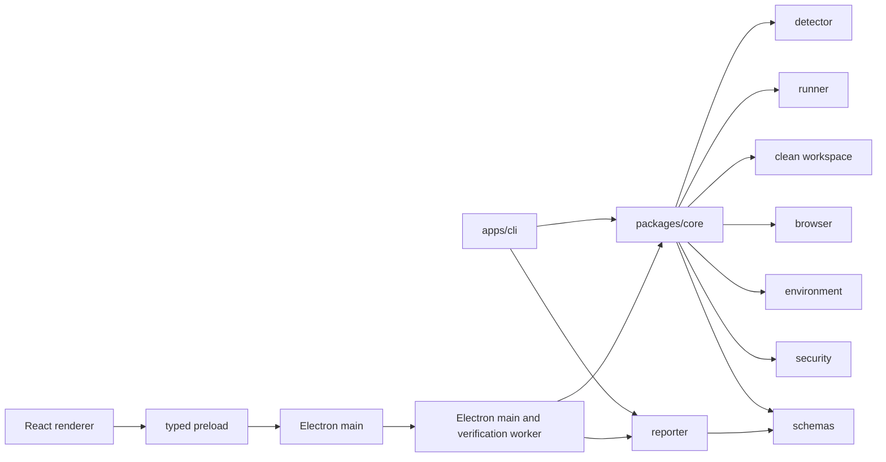

# Target architecture and ownership boundaries

## Dependency direction

`packages/schemas` owns wire/report/config/event types and parsing; Core owns detection orchestration, check scheduling, verdict and cancellation semantics; `runner` owns process execution/ownership; `browser` owns page/API observations; `reporter` owns pure renderers. Neither CLI nor renderer may recalculate verdicts. Packages must not import Desktop or CLI.

## Verification session

**ARCH-SESSION-001 · P0:** One `VerificationSession` has immutable run ID, selected project + target root, normalized config, AbortSignal, phase/event stream, owned processes and temp resources, and one terminal result. Progress event order is monotonic; cancellation and errors still produce a report or a typed internal/cancel outcome, never a fabricated READY. A concurrent verify for the same target is either rejected with a clear message or isolated by unique workspace/artifact run ID; no shared mutable global process hooks.

Pipeline: validate request/config → detect project and candidate targets → select target → snapshot source identity → register sensitive values → make clean workspace → install → build → start/port ownership/stability → route/API/browser verification → static environment/security/docs checks (can run before dynamic phases) → score/verdict → redact and persist report artifacts → terminate owned processes → remove temporary workspace → emit final. Short-circuit dependent phases after a failed prerequisite, but record them as skipped **with reason**. Crucially, a missing runtime proof cannot become READY.

## Desktop call chain

Renderer → narrow typed preload API → validated IPC in main → dedicated Electron utility process or equivalent isolated Node worker process → `verifyProject` in shared Core. Main controls folder dialogs, recent-project persistence, safe OS file open, clipboard and lifecycle; worker executes project code and streams sanitized progress/logs. Renderer has no Node APIs and never spawns processes. See [08](08_DESKTOP_TECHNICAL_ARCHITECTURE.md).

## Report production

Core returns a schema-validated structured report; reporter derives JSON/HTML/AI Markdown from that report. CLI and Desktop consume the same artifact object. Redaction occurs before event emission and at **every** output boundary; HTML escapes text and safely serializes data. `report.json`, `report.html`, `RELEASEPROOF_FIX.md` live under selected project `.releaseproof/` with per-run identifiers or latest-pointer semantics that prevent stale reports from being mistaken for a new run. [11](11_REPORTING_AND_AI_HANDOFF.md) owns exact schema.

## Lifecycle and failure boundaries

**ARCH-LIFE-001 · P0:** Core/runner track only processes they spawn. Startup checks a preoccupied endpoint before launch, then binds observed responses to owned process lifetime and chosen port. Cancel/timeout/close requests reach session AbortSignal, terminate owned process trees gracefully then forcefully after a bounded delay, close browser/context, and dispose temp workspace with bounded retries and visible cleanup error. Never kill foreign listener by port number. Windows `taskkill` and POSIX process groups are implementation mechanisms, not evidence of cleanup until verified. See [04](04_CORE_VERIFIER_SPEC.md), [10](10_SECURITY_PRIVACY.md).

## Packaging boundary

The Desktop package embeds the Electron/Node runtime and bundled shared Core; it is self-launching without system Node/pnpm. Project-specific Node/Python/package managers, browser binaries, databases, native build tools and network may still be needed for **verification**, with capability-specific Doctor messages. Windows installer and CLI tarball are built from one reviewed source commit and independently E2E-tested. See [14](14_CI_CD_AND_RELEASE.md).
